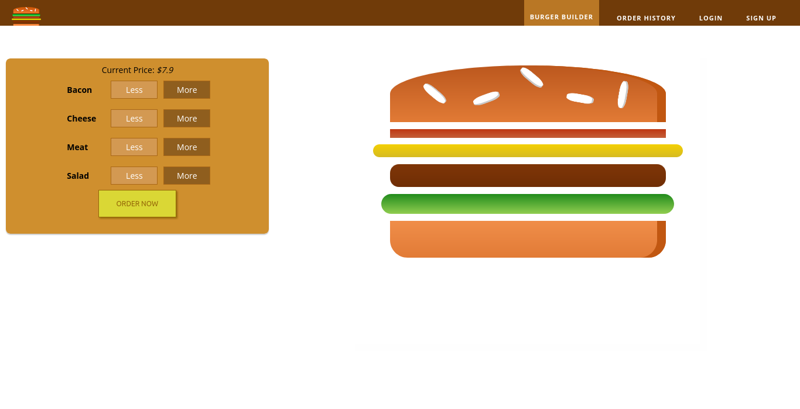
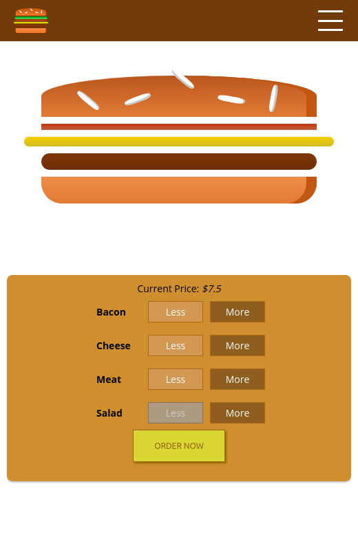
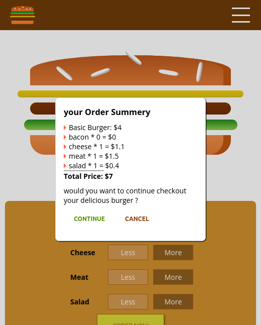

# Burger Builder
Burger Builder web application developed with ReactJS, where you can build your own favourite burger.  

## Features
- build your burger by adding ingredients to it
- get an order summery to see whether to continue with your order or not
- continue / cancel you order
- store and retrieve data using firebase realtime database  
- informing user with any error that happened and any success of any operation
- using spinners to enhance the user experience
- responsive on small screens

## Demo Screens
  
  
  

## installation
- run npm install
- run npm start
